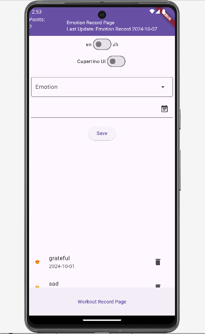
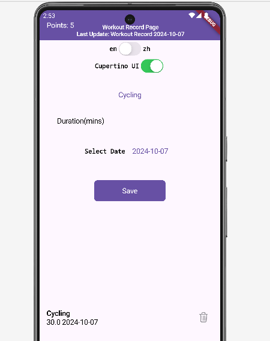
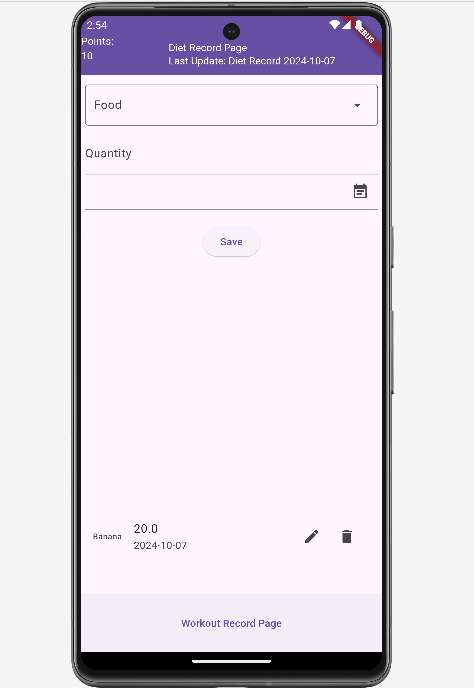

# Daily Record App

An application include emotion, diet, workout record pages.
Technologies: Flutter, Firebase(Authorization, Function, Firestore Database), Cupertino UI, Material UI, MVVM Design Pattern, SQLite

## Screenshots

    
        
The Emotion Record Page.

     
    
The Workout Record Page. (Demonstrate in Cupertino UI)

    
    
The Diet Record Page.

## Getting Started

To run Daily Record App locally on your machine, follow these steps:

1. Clone this repository.
2. Navigate to the project directory.
3. Currently, the Database is connected to our own Firebase database; if you'd like to use your Database, remember to replace the `firebase_options.dart` file and update the path.

## License

Daily Record App is released under the [MIT License](/path/to/license).

